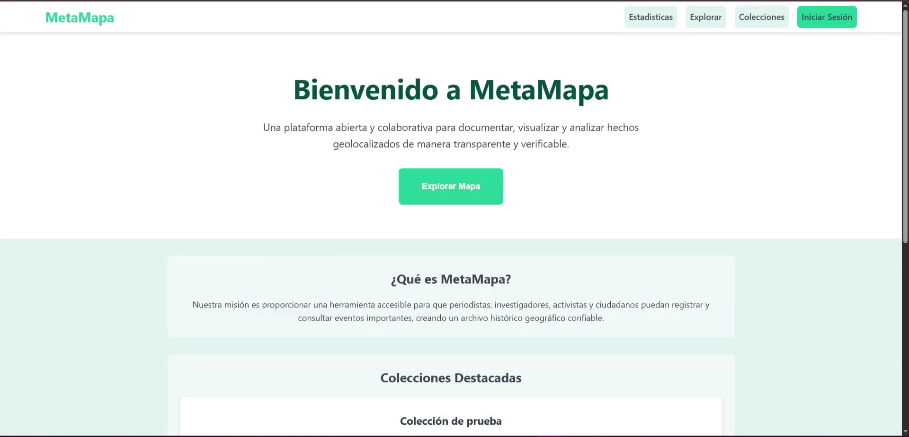
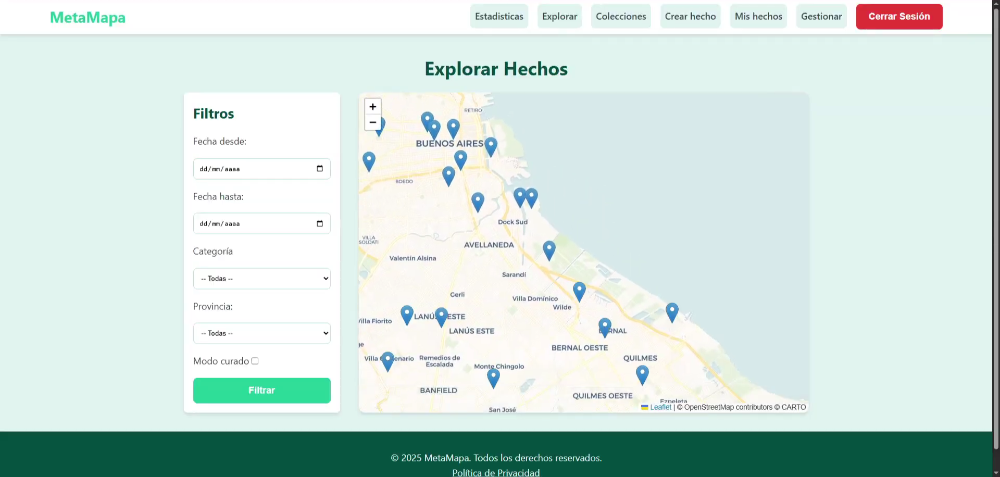
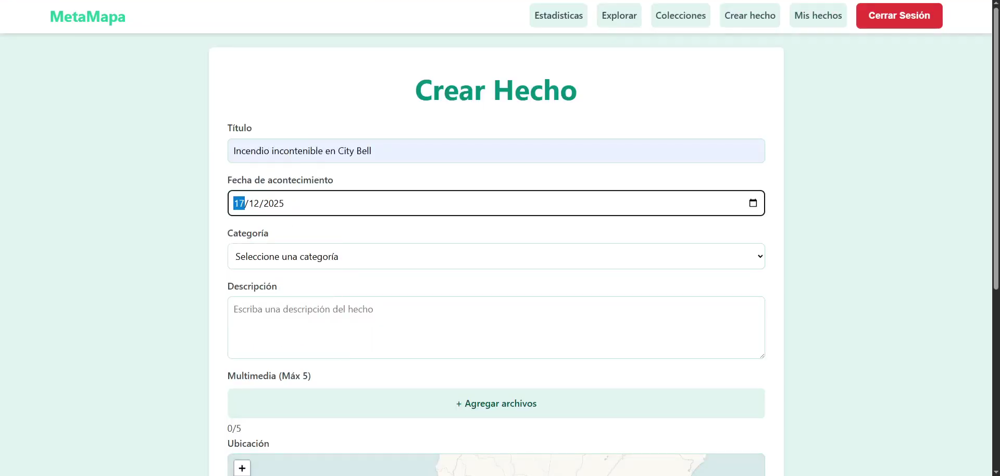
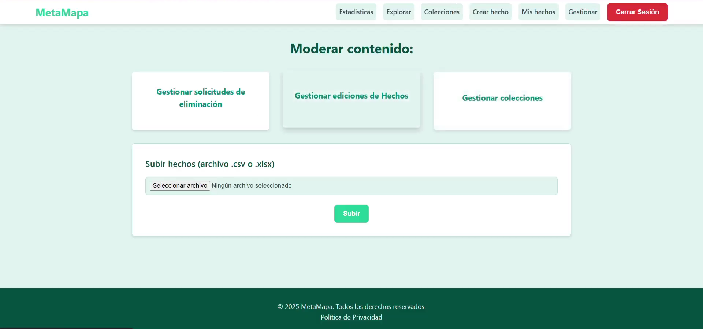
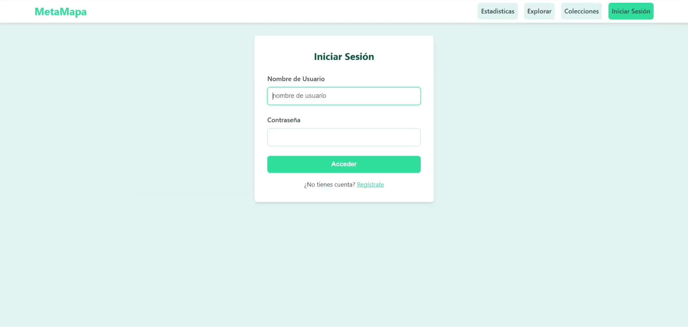
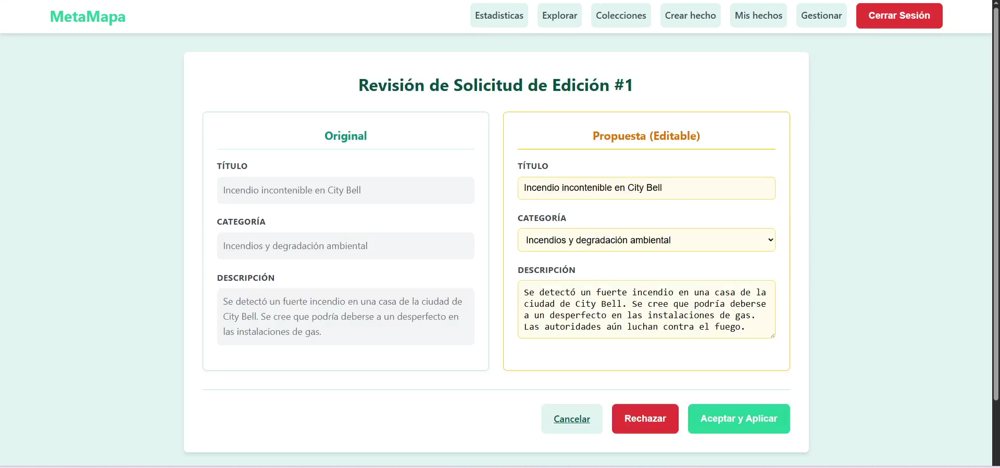

# MetaMapa

**MetaMapa** es un sistema de código abierto de mapeo colaborativo, desarrollado como Trabajo Práctico Anual Integrador para la materia **Diseño de Sistemas de Información (DDSI) – UTN FRBA, 2025**.

La plataforma permite documentar, visualizar y analizar **hechos geolocalizados** de forma transparente, verificable y colaborativa. Está diseñada para ser instalada y operada por ONGs, universidades u organismos estatales, priorizando la privacidad de sus usuarios y la integridad de la información.

---

## Capturas de pantalla

| Landing                           | Explorar Hechos                           |
|-----------------------------------|-------------------------------------------|
|  |  |

| Crear Hecho                        | Panel de Gestión                       |
|------------------------------------|----------------------------------------|
|  |  |

| Inicio Sesion                          | Editar Hechos                          |
|----------------------------------------|----------------------------------------|
|  |  |

---

##  Descripción del Proyecto

MetaMapa centraliza la inteligencia colectiva mediante el registro georeferenciado de hechos relevantes: incendios, causas ambientales, contaminación, desapariciones forzadas, entre otros. Cada instancia del sistema puede operar de forma autónoma y comunicarse con otras instancias a través de una API REST estándar.

El sistema garantiza:
- **Descentralización**: cada instancia gestiona sus propias fuentes de datos.
- **Privacidad**: no se recopilan datos de visitantes anónimos.
- **Verificabilidad**: los hechos pueden pasar por algoritmos de consenso antes de considerarse curados.
- **Transparencia**: el código es abierto y toda la información es auditable.

---

##  Arquitectura del Sistema

El sistema está organizado como una arquitectura de **microservicios**, donde cada componente es un servicio independiente con su propia base de datos relacional. Los servicios se comunican entre sí a través de APIs REST.

```
┌─────────────────────────────────────────────────────────┐
│                        Frontend                         │
│               (Cliente Liviano - MVC/SSR)               │
└──────────────────────────┬──────────────────────────────┘
                           │ REST
          ┌────────────────┼──────────────────┐
          ▼                ▼                  ▼
   ┌─────────────┐  ┌────────────┐   ┌──────────────┐
   │  Agregador  │  │  Usuarios  │   │ Estadísticas │
   └───────┬─────┘  └────────────┘   └──────────────┘
           │
   ┌─────────────┬────────────────────┐
   ▼             ▼                    ▼
┌──────┐ ┌──────────────┐      ┌─────────────┐
│Fuente│ │    Fuente    │      │   Fuente    │
│Estát.│ │   Dinámica   │      │    Proxy    │
└──────┘ └──────────────┘      └─────────────┘
    │             │              │     │
    ┴───────┼─────┴──────────────┴     │
            ▼                   ┌──────┴──────┐
     ┌──────────────┐           ▼             ▼
     │ Normalizador │        APIs externas  Otras instancias
     └──────────────┘        (ONGs)         de MetaMapa
```

### Módulos del repositorio

| Módulo | Descripción |
|---|---|
| `FuenteEstatica` | Servicio de solo lectura que publica hechos a partir de datasets (CSV/XLSX) |
| `FuenteDinamica` | Servicio para la subida colaborativa de hechos por usuarios anónimos o registrados |
| `FuenteProxy` | Integración con APIs externas de otras ONGs e instancias de MetaMapa |
| `Agregador` | Consulta todas las fuentes, aplica algoritmos de consenso y expone una API unificada |
| `Normalizador` | Estandariza categorías, provincias, municipios y fechas provenientes de distintas fuentes |
| `Estadisticas` | Genera dashboards y métricas periódicas sobre los hechos; exporta datos en CSV |
| `Usuarios` | Gestión de autenticación, registro y roles (visitante, contribuyente, administrador) |
| `Frontend` | Cliente web liviano (SSR con motor de plantillas) que consume las APIs REST |

---

## Funcionalidades Principales

### Para visitantes (sin registro)
- Explorar hechos en un **mapa interactivo** (Leaflet) con marcadores geolocalizados.
- Filtrar por fecha, categoría, provincia y modo de navegación (curado / irrestricto).
- Visualizar detalles de cada hecho, incluyendo multimedia.
- Explorar **colecciones** temáticas destacadas.
- Generar solicitudes de eliminación de hechos con justificación.

### Para contribuyentes (registrados)
- Subir nuevos hechos con título, descripción, categoría, ubicación, fecha y archivos multimedia (hasta 5 archivos).
- Editar los propios hechos dentro de los **7 días** posteriores a su creación.
- Subir hechos de forma anónima (sin posibilidad de edición posterior).
- Solicitar la eliminación de hechos existentes.

### Para administradores
- **Panel de gestión** con moderación de contenido.
- Aprobar, rechazar o aceptar con modificaciones los hechos enviados por contribuyentes.
- Gestionar solicitudes de eliminación (incluyendo rechazo automático de spam).
- Crear, editar y eliminar colecciones.
- Configurar fuentes (estáticas, dinámicas y proxy) por colección.
- Configurar el **algoritmo de consenso** por colección.
- Importar hechos en lote mediante archivos CSV o XLSX.

### Estadísticas y datos
- Dashboard con métricas actualizadas periódicamente:
  - Provincia con más hechos reportados.
  - Categoría más frecuente.
  - Distribución horaria de hechos por categoría.
  - Porcentaje de solicitudes de eliminación clasificadas como spam.
- Exportación de estadísticas en formato **CSV**.

---

## Algoritmos de Consenso

Al crear una colección, se puede configurar opcionalmente un algoritmo que determina cuándo un hecho se considera *consensuado* y aparece en el modo curado:

| Algoritmo | Criterio |
|---|---|
| **Múltiples menciones** | Al menos 2 fuentes reportan el mismo hecho sin contradicciones |
| **Mayoría simple** | Al menos la mitad de las fuentes contienen el mismo hecho |
| **Absoluta** | Todas las fuentes contienen el mismo hecho |
| *(Sin algoritmo)* | Todos los hechos se consideran consensuados |

Los algoritmos se ejecutan de forma **asincrónica y calendarizada** en horarios de baja carga.

---

## API REST Pública

MetaMapa expone una API para que otras instancias o sistemas externos puedan integrarse:

| Método | Endpoint | Descripción |
|---|---|---|
| `GET` | `/hechos` | Lista todos los hechos con filtros opcionales (categoría, fechas, ubicación) |
| `GET` | `/colecciones` | Lista todas las colecciones disponibles |
| `GET` | `/colecciones/:id/hechos` | Hechos de una colección específica con filtros |
| `POST` | `/solicitudes` | Crea una solicitud de eliminación de un hecho |

---

## Stack Tecnológico

| Capa | Tecnología |
|---|---|
| Lenguaje principal | Java 17 |
| Framework web | Spring Boot |
| Persistencia | ORM (JPA/Hibernate) + bases relacionales por servicio |
| Motor de plantillas (Frontend) | Server-Side Rendering (SSR) |
| Mapas | Leaflet + OpenStreetMap / CARTO |
| Testing | JUnit 5 |
| Build | Maven 3.8.1+ |
| Contenedores | Docker / Dockerfile por servicio |
| Observabilidad | Datadog (`dd-java-agent`) |

---

## Cómo ejecutar el proyecto

### Requisitos previos
- Java 17+
- Maven 3.8.1+
- Docker (opcional, para despliegue con contenedores)

### Configuración del IDE (IntelliJ IDEA)
1. Usar **Java SDK 17** en File → Project Structure → Project.
2. Configurar **fin de línea Unix** en Editor → Code Style.
3. **Indentación** con 2 espacios (Tab size: 2, Indent: 2, Continuation indent: 4).
4. Instalar el plugin **Checkstyle-IDEA** y activar los checks de Google (versión 9.0.1).

---

##  Estructura del repositorio

```
DDSI-2025-TPanual/
├── Agregador/          # Servicio de agregación y consenso
├── Estadisticas/       # Servicio de estadísticas y dashboards
├── Frontend/           # Cliente web liviano (SSR)
├── FuenteDinamica/     # Fuente dinámica (contribuciones de usuarios)
├── FuenteEstatica/     # Fuente estática (datasets)
├── FuenteProxy/        # Fuente proxy (integraciones externas)
├── Normalizador/       # Normalización de datos
├── Usuarios/           # Autenticación y gestión de roles
├── SCRIPTS/            # Scripts auxiliares (deploy, BD, etc.)
├── diagrams/           # Diagramas de arquitectura y dominio
├── testPrimerEntrega/  # Tests de la primera iteración
└── pom.xml             # POM raíz del proyecto Maven
```

---

## Entregas del Trabajo Práctico

| # | Título | Contenido principal |
|---|---|---|
| 1 | Arquitectura y Modelado en Objetos I | Modelado inicial del dominio, fuente estática |
| 2 | Arquitectura y Modelado en Objetos II | Fuente dinámica, fuente proxy, servicio de agregación |
| 3 | Integración y Modelado en Objetos III | API REST, algoritmos de consenso, modos de navegación |
| 4 | Persistencia y Análisis de Datos | ORM, normalización, estadísticas, exportación CSV |
| 5 | Arquitectura Web MVC y UI | Cliente liviano (SSR), mapa interactivo, SSO |
| 6 | Despliegue, Observabilidad y Seguridad | Docker, Datadog, seguridad de la plataforma |

---

##  Documentación

- [Memoria Técnica y Justificaciones de Diseño](https://docs.google.com/document/d/16u011LlpH063zOflb_Yh9cTvy7jmLuur/edit?usp=sharing)
- [Enunciado Entrega 1](https://docs.google.com/document/d/1ctxGwWrnM0XmPii38KWod9mTzphzNxxPRg9HkpXyNBg/edit)
- [Enunciado Entrega 2](https://docs.google.com/document/d/1f7a_fd9na5_3E6EzfIyAGn0FSMXAA7OURMPiPkvz7c0/edit)
- [Enunciado Entrega 3](https://docs.google.com/document/d/1dESN18hVwo6pg2UhyZoV4vHDD08FsRlzNQH97gd630s/edit)
- [Enunciado Entrega 4](https://docs.google.com/document/d/1Y-FelsGkQ5HopDlsP_2-ykUh7lzJQgWdi_4kcVMp4I4/edit)
- [Enunciado Entrega 5_5](https://docs.google.com/document/d/1zdspGp8ezV8eWMqJcXg8uxArk5RhAe84FnubIy7Xcq4/edit?tab=t.0#heading=h.wg2wihq8optu)
  
---

##  Equipo

Proyecto desarrollado por el **Grupo 01** en el marco de la materia **Diseño de Sistemas de Información – UTN FRBA (2025)**.
- **Vera Ramiro** ([GitHub](https://github.com/vrramiro)) 
- **Fustinoni Santino** ([GitHub](https://github.com/SantiFustinoni))
- **Tuma Nicolas** ([GitHub](https://github.com/NicolasTuma))
- **Contini Francine** ([GitHub](https://github.com/francontini))
- **Santoro Emanuel** ([GitHub](https://github.com/EmaSantoro))

---

